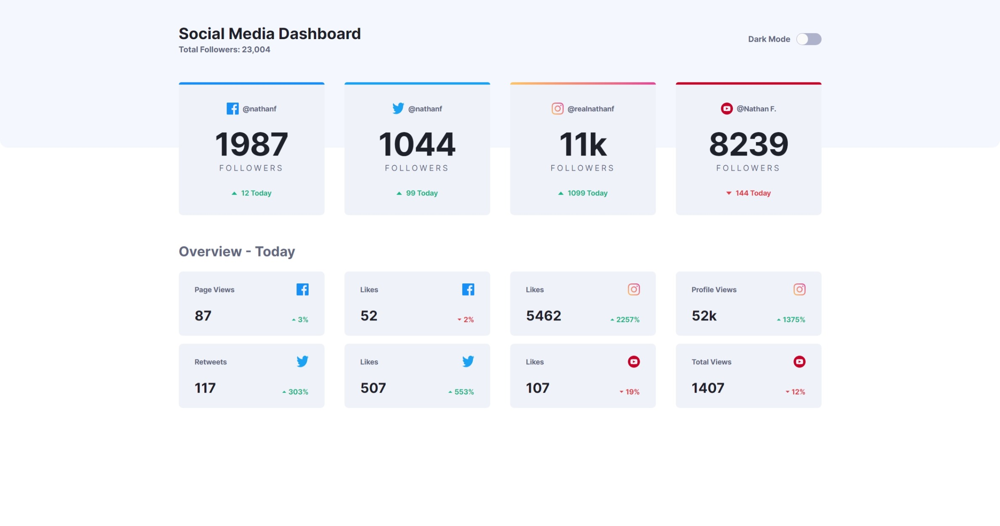
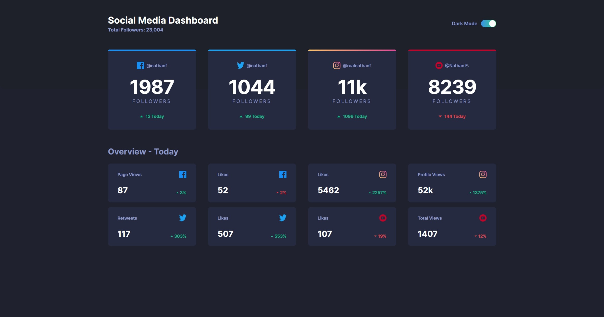

# Frontend Mentor - Social Media Dashboard with theme switcher solution

This is a solution to the [Social Media Dashboard with theme switcher challenge on Frontend Mentor](https://www.frontendmentor.io/challenges/social-media-dashboard-with-theme-switcher-6oY8ozp_H).

I happy to say that this will be the third FEM challenge I have completed thus far, and also my first Junior level challenge. The end result turned out to be much better than expected, especially with the transitions in color when toggling between light and dark mode.

Due to a little bit of procrastination, I finished this challenge a little later than what I would have liked.

Estimated: 1 week\
Actual: 2 weeks

## Table of contents

- [Overview](#overview)
  - [The Challenge](#the-challenge)
  - [Screenshots](#screenshots)
  - [Links](#links)
- [My Process](#my-process)
  - [Built with](#built-with)
  - [What I learned](#what-i-learned)
    - [SASS](#sass)
    - [Auto-grid Layout](#auto-grid-layout)
  - [Useful Resources](#useful-resources)

## Overview

### The Challenge

Users should be able to:

- View the optimal layout for the site depending on their device's screen size
- See hover states for all interactive elements on the page
- Toggle color theme to their preference

### Screenshots





### Links

- Challenge URL: [https://www.frontendmentor.io/challenges/social-media-dashboard-with-theme-switcher-6oY8ozp_H](https://www.frontendmentor.io/challenges/social-media-dashboard-with-theme-switcher-6oY8ozp_H)
- Solution URL: [https://github.com/ning-sy210/social-media-dashboard](https://github.com/ning-sy210/social-media-dashboard)
- Live Site URL: [https://ning-sy210.github.io/social-media-dashboard/](https://ning-sy210.github.io/social-media-dashboard/)

## My process

### Built with

- [React](https://react.dev/) (TypeScript)
- [SASS](https://sass-lang.com/)
- Flexbox
- Grid

### What I learned

#### SASS

In this challenge, the main goal is to gain familiarity with SASS. One of the reasons why I chose to use SASS for this project is because of all the added functionality that it provides on top of vanilla CSS, such as CSS nesting, interpolation and imperative-programming-like syntax (e.g. loops), just to name a few.

A feature of SASS that I really enjoyed a lot is the ability to declare all of my variables in one single file (in my case, I named it `_abstract.scss`). This file essentially lays out all of the colors, media query breakpoints (and etc) that I will be using in the project, and if I want to switch things around, having everything in one place makes it a breeze to work with.

```scss
$bp--tablet: 768px;
$bp--mobile-m: 375px;

$color-white: hsl(0, 0%, 100%);

$color-primary--lime-green: hsl(163, 72%, 41%);
$color-primary--bright-red: hsl(356, 69%, 56%);
$color-primary--facebook: hsl(208, 92%, 53%);
$color-primary--twitter: hsl(203, 89%, 53%);
$color-primary--instagram: linear-gradient(
  to right,
  hsl(37, 97%, 70%),
  hsl(329, 70%, 58%)
);
$color-primary--youtube: hsl(348, 97%, 39%);

$color-toggle--dark: linear-gradient(
  to right,
  hsl(210, 78%, 56%),
  hsl(146, 68%, 55%)
);
$color-toggle--light: hsl(230, 22%, 74%);

$color-app-bg__top--dark: hsl(230, 17%, 14%);
$color-app-bg--dark: hsl(232, 19%, 15%);
$color-card-bg--dark: hsl(228, 28%, 20%);
$color-card-bg-hover--dark: hsl(229deg 29% 26%);
$color-card-bg-active--dark: hsl(229deg 30% 17%);
$color-text-main--dark: $color-white;
$color-text-sub--dark: hsl(228, 34%, 66%);

$color-app-bg__top--light: hsl(225, 100%, 98%);
$color-app-bg--light: $color-white;
$color-card-bg--light: hsl(227, 47%, 96%);
$color-card-bg-hover--light: hsl(228deg 32% 92%);
$color-card-bg-active--light: hsl(226deg 27% 87%);
$color-text-main--light: hsl(230, 17%, 14%);
$color-text-sub--light: hsl(228, 12%, 44%);
```

This challenge also provides an opportunity to play around with theme switching, which is something that I was interested in doing for a long time. I figured this challenge would be the perfect playground for picking up SASS as well, as I can see the interpolation and `@each` loop features in SASS coming in handy to manage the styling for different theme variants, which you can see in action below:

```scss
@use "sass:map";
@use "../../../styles/abstracts" as *;

.sm-main-card {
  // ... (other details omitted for brevity)

  // defining the child element colors of SocialMainCard component for
  // each theme
  $theme-colors: (
    "light": (
      "card-bg-color": $color-card-bg--light,
      "card-bg-hover-color": $color-card-bg-hover--light,
      "card-bg-active-color": $color-card-bg-active--light,
      "text-main-color": $color-text-main--light,
      "text-sub-color": $color-text-sub--light,
    ),
    "dark": (
      "card-bg-color": $color-card-bg--dark,
      "card-bg-hover-color": $color-card-bg-hover--dark,
      "card-bg-active-color": $color-card-bg-active--dark,
      "text-main-color": $color-text-main--dark,
      "text-sub-color": $color-text-sub--dark,
    ),
  );

  // using loop and interpolation to generate the relevant CSS theme
  // classes, which helps omit repeated declarations of similar classes
  // and conforming to the DRY principle
  @each $theme, $colors in $theme-colors {
    &--theme-#{$theme} {
      background-color: map.get($colors, "card-bg-color");
      color: map.get($colors, "text-main-color");

      .platform-handle__username,
      .follower-count-ctn__label {
        color: map.get($colors, "text-sub-color");
      }

      &:hover {
        background-color: map.get($colors, "card-bg-hover-color");
      }

      &:active {
        background-color: map.get($colors, "card-bg-active-color");
      }
    }
  }
}
```

As compared to the vanilla CSS equivalent below:

```scss
// LIGHT theme
.sm-main-card--theme-light {
  // ... (other details omitted for brevity)

  background-color: var(--color-card-bg--light);
  color: var(--color-text-main--light);
}

// UPDATE: repeated declaration of .sm-main-card--theme-light can be
// omitted with introduction of CSS nesting in vanilla CSS as of May 2023
.sm-main-card--theme-light .platform-handle__username,
.sm-main-card--theme-light .follower-count-ctn__label {
  color: var(--color-text-sub--light);
}

.sm-main-card--theme-light:hover {
  background-color: var(--color-card-bg-hover--light);
}

.sm-main-card--theme-light:active {
  background-color: var(--color-card-bg-active--light);
}

// DARK theme
.sm-main-card--theme-dark {
  // ... (other details omitted for brevity)

  background-color: var(--color-card-bg--dark);
  color: var(--color-text-main--dark);
}

// UPDATE: repeated declaration of .sm-main-card--theme-dark can be
// omitted with introduction of CSS nesting in vanilla CSS as of May 2023
.sm-main-card--theme-dark .platform-handle__username,
.sm-main-card--theme-dark .follower-count-ctn__label {
  color: var(--color-text-sub--dark);
}

.sm-main-card--theme-dark:hover {
  background-color: var(--color-card-bg-hover--dark);
}

.sm-main-card--theme-dark:active {
  background-color: var(--color-card-bg-active--dark);
}
```

Even though there is little difference in the number of lines written to achieve the same style, I believe SASS makes it way less verbose by removing the need for repeated declaration of common base (parent) classes.

Another important consideration is that we are only concerning ourselves with two themes here. If there are multiple themes that need to be supported in the application, the vanilla CSS file would grow in character count very quickly, whereas all that needs to be done in SASS is to simply extend the `$theme-colors` mapping values. Also, if a certain variable name needs to be changed, the name can also be quickly altered in the map and `@each` loop without fear of missing out on a few, causing things to unintentionally break. These reasons are what I think makes SASS a very scalable solution, even for projects at scale.

#### Auto-grid Layout

Another thing I was excited to learn about is a CSS magic trick which achieves responsiveness without use of any media queries. This line of CSS is the one I am referring to:

```css
.auto-grid {
  display: grid;
  grid-template-columns: repeat(auto-fit, minmax(272px, 1fr)); // this one!
}
```

For this challenge, after undergoing multiple rounds of trial-and-error to arrive at the min-width value of `272px`, this line essentially removed all need for writing any media queries while still ensuring that the application is perfectly responsive to any screen size! This saved me so much effort and it will be something that I will try to make use of in very project moving forward!

### Useful resources

- [Mozilla](https://developer.mozilla.org/en-US/) - CSS docs
- [Css-Tricks](https://css-tricks.com/) - Where I found the auto-grid layout and I will recommend it to anyone new to it and is interested in how it works!
- [Sass Docs](https://sass-lang.com/documentation/)
